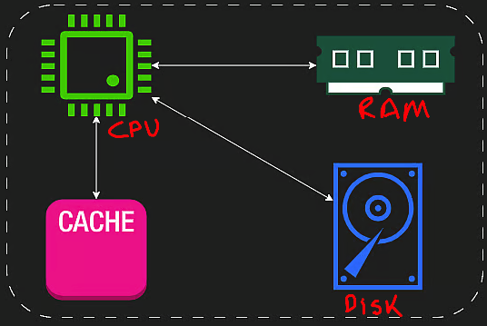

# Computer Architecture

I have to first understand the different components of a computer and their role.

## Components

### Disk

It's the storage device and persistent which means that data will be there regardless the state of the machine (turned on or off).
The amount of data that can store is huge and nowadays is usually measured in TB (Terabytes).
You measure the writting speed on milliseconds.
There are two types: HDD and SSD, with the later ones being more popular / faster.

### RAM

Stands for Random Access memory it also stores information, but is a lot smaller compared to disk.
RAM sizes generally vary between 1GB - 128GB, and is much more expensive than disk space, because reading and writing to RAM is much faster.
You measure the writting speed on microseconds.
It keeps applications that were open in memory, and it's a volatile memory because data gets erased once the computer is shut down.
RAM and disk don't communicate with each other, they rely on the CPU to facilitate data transfer.

### CPU

Central Processing Unit is the brain of the computer and the intermediary between RAM and disk.
If I write code and run it, the code it will translated with a compiler into a set of bytes and then read and executed by the CPU.
It handles all computations like, sum, subtract, multiply, ... it doesn't decide if something is stored on RAM or disk, that's the Operating System.
The CPU executes instructions and read and writes to RAM memory using addresses.
It also has a cache which is like a fast memory.

