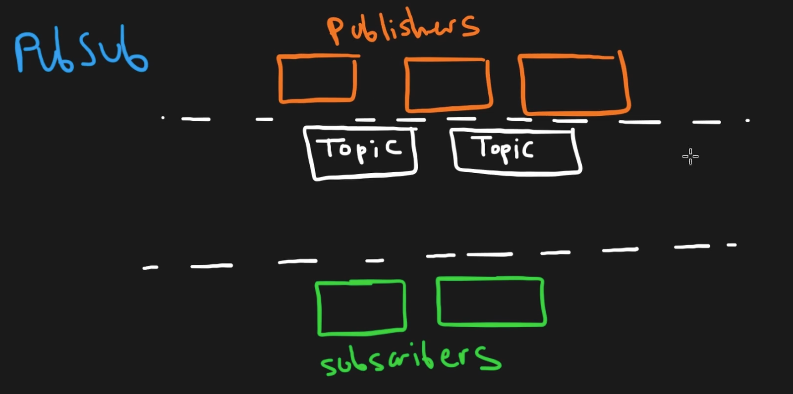
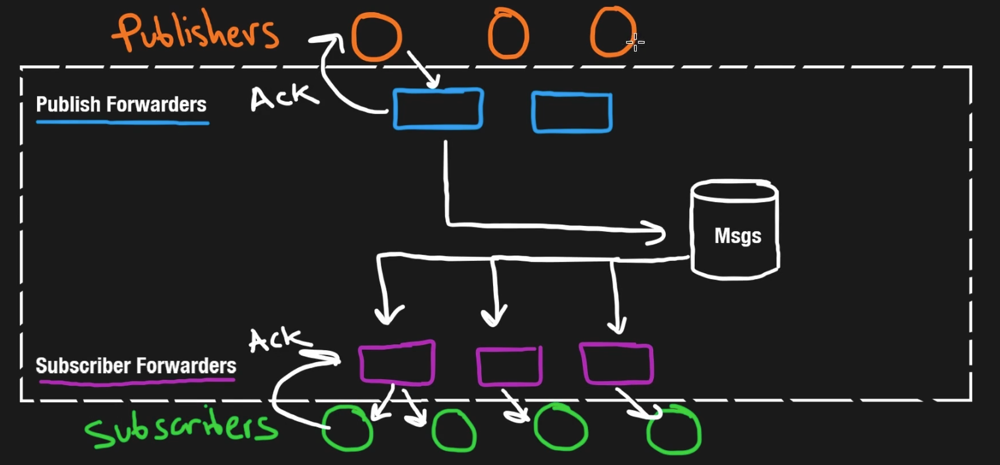

## Goal

Design a scalable message queue system.

## Background

Message queues decouple producers and consumers:

- **Point-to-point model:** One producer, one consumer.
- **Pub/Sub model:** One or more producers publish to a **topic**, and multiple consumers (subscribers) receive the message.
- Common use case: for example, an app sends a payment request to a queue, allowing the main flow to continue while the payment is processed asynchronously.

## Functional Requirements

- Support publishing messages to a topic.
- Support multiple subscribers per topic (fan-out).
- Retain messages until all subscribers have acknowledged them.
- Support **at-least-once delivery**.
- Support **FIFO (first-in-first-out)** message ordering per topic.

## Non-Functional Requirements

- **Horizontal scalability**: Should scale by adding more nodes.
- **High throughput**: Handle a high volume of messages efficiently.
- **Durability**: Persist messages to avoid data loss (e.g., after crash).
- **Low latency**: Fast delivery to consumers, especially in push mode.

## Architecture Overview

Producer(s)

↓

[ Topic / Message Queue ]

↓

Forwarder(s) → Consumer(s)

↘

Persistent Storage (DB)

- Producers publish messages to **topics**.
- Messages are stored in a **database** (can be SQL for ACID guarantees).
- Forwarders manage the delivery to subscribers (like a mailman).
- Consumers process messages asynchronously.

## Message Structure (Example)

- `id`: unique identifier (could be time-based for ordering)
- `topic_id`
- `payload`: JSON-encoded message
- `published_at`
- `status`: pending, acknowledged
- `ack_by`: list of consumer IDs that have acknowledged

## Storage

- SQL is suitable initially due to:
  - Strong **ACID** guarantees (especially **isolation** for concurrent writes).
  - Simple schema and ordering logic.
- Use timestamps for IDs to enforce FIFO delivery.

## Retention Policies

- **Ack-based cleanup**: Delete messages once all subscribers acknowledge.
- **Time-based cleanup**: Delete messages older than N days regardless of acknowledgment.
- Retention strategy should be configurable per topic.

## Delivery Mechanisms

### Pull

- Consumers poll the queue periodically (e.g., via HTTP).
- Higher latency but simpler.
- Suitable when consumers are not always connected.

### Push

- Consumers maintain open connections (e.g., WebSockets).
- Messages pushed as soon as they arrive.
- Lower latency, but can overload slower consumers.

## Trade-offs

| Strategy | Latency | Load on Consumer | Complexity   |
| -------- | ------- | ---------------- | ------------ |
| Pull     | Higher  | Lower            | Simpler      |
| Push     | Lower   | Higher           | More complex |

