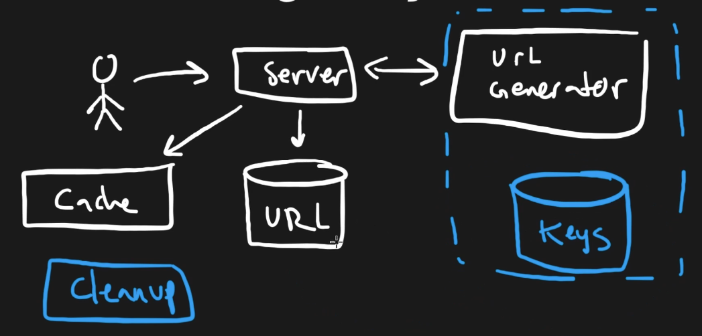
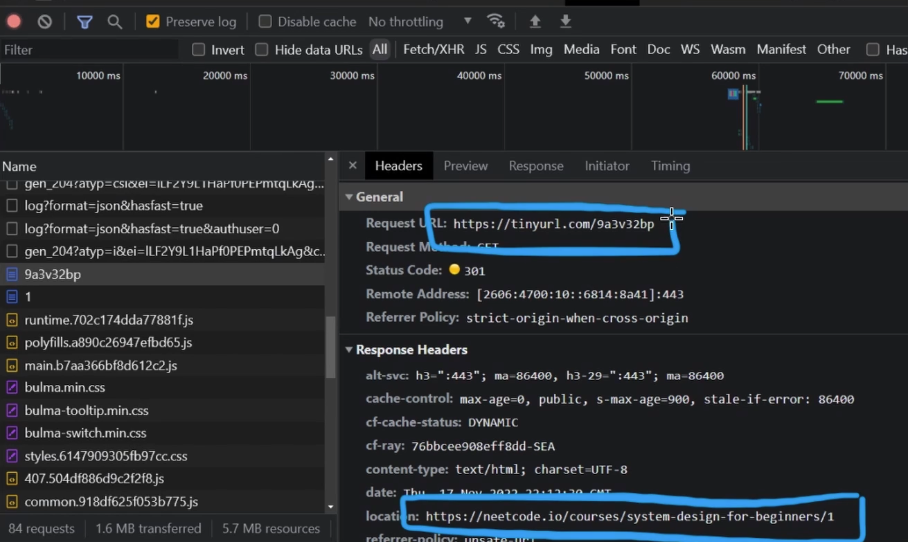

## Goal

Build a service that generates a short URL that maps to a long/original URL.

## Functional Requirements

- Generate a short URL from a given long URL.
- Redirect users from the short URL to the original URL.
- Support optional **custom aliases** for short URLs (doesn't have a lot of impact on the architecture).
- Decide whether repeated long URLs from different users should map to the same short URL or generate new ones.
- Consider expected scale (e.g., number of users and requests per second).

## Non-Functional Requirements

- **High read-to-write ratio:** more users will be accessing short URLs than creating them.
- **Low latency** for redirection (ideally sub-100ms).
- **High availability** is important since many user-facing apps may rely on the service.
- Use **caching** for most frequently accessed short URLs to reduce DB hits.
  - Recommended: LRU (Least Recently Used) over LFU, as URL popularity can change rapidly.
- Response should return HTTP **301 (Moved Permanently)** with a `Location` header.
  - Browsers will cache this and reduce future load on the service.

## Architecture Overview

Client → Shorten URL API (\*) → URL Generator Service → SQL DB (Keys Pool)

(\*) → URL Mapping DB (short ↔ long)

(\*) → Cache (Least Recently Used - LRU)

- Users create short URLs through a URL Shortening API.
- When accessed, the short URL is resolved from a cache or DB.
- A 301 redirect is returned with the long URL.



## Key Components

### URL Generator Service

- Responsible for generating unique short keys.
- To ensure **uniqueness and avoid race conditions**, better to use a **SQL database** with strong ACID guarantees:
  - **Atomicity** and **Isolation** are key to avoid duplicates when concurrent requests occur.
- Pre-generate a pool of short keys and mark as used or unused in the DB, instead of generate on the fly.

### URL Mapping Database

- Schema:
  - `id`
  - `short_url`
  - `long_url`
  - `expiration_timestamp`

### Cleanup Service

- Periodically checks the URL mapping DB for expired entries.
- Frees up associated keys in the generator’s key pool DB for reuse.

## Caching

- Use a key-value store (e.g., Redis) to cache frequently used short → long URL mappings.
- Reduces DB lookups and improves latency.
- Eviction strategy: Least Recently Used (LRU).

## Redirection Logic

- When a user accesses a short URL:
  - Check the cache for the long URL.
  - If not found, query the URL mapping DB.
  - Return `301 Moved Permanently` with the long URL in the `Location` header.

```http
HTTP/1.1 301 Moved Permanently
Location: https://example.com/very/long/path
```



- Browser caches this redirection for future visits.

### Notes

Here we can also consider 302, which will makes the request go through the server.
It can be an option if we want to gather information for KPIs.
