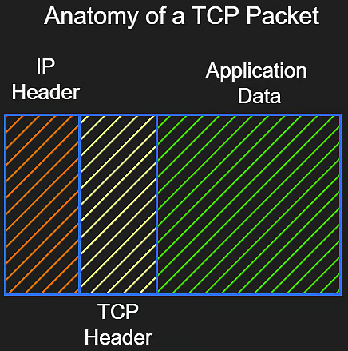
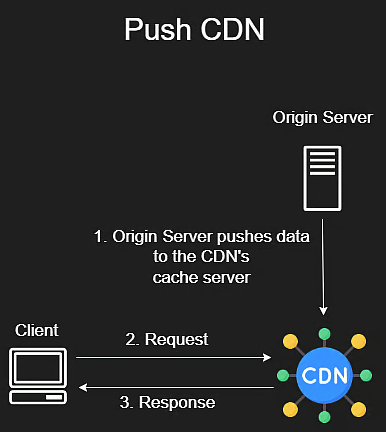
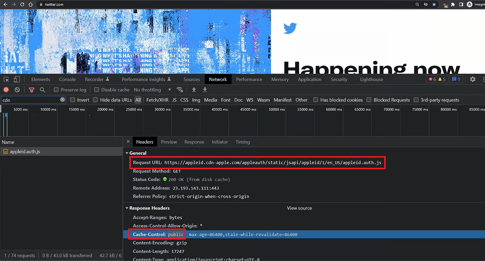
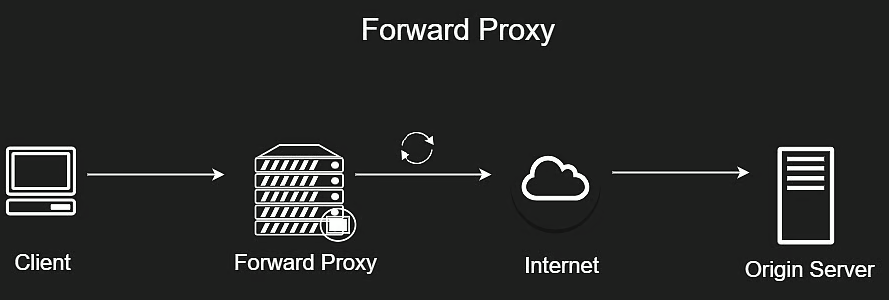
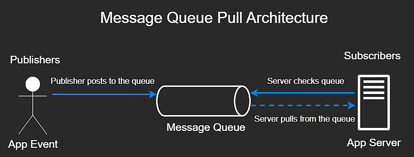
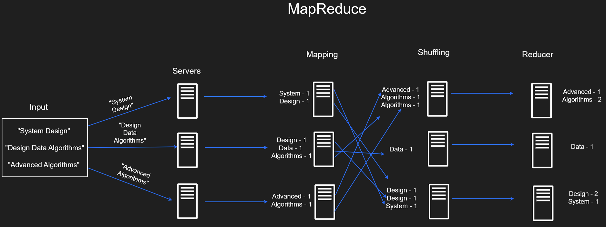

# System Design

## Table of Contents

### 1. Background

- [1.1 Computer Architecture](#11-computer-architecture)
- [1.2 Application Architecture](#12-application-architecture)
- [1.3 Design Requirements](#13-design-requirements)

### 2. Networking

- [2.1 Networking Basics](#21-networking-basics)
- [2.2 TCP & UDP](#22-tcp--udp)
- [2.3 DNS](#23-dns)

### 3. APIs

- [3.1 HTTPS](#31-https)
- [3.2 WebSockets](#32-websockets)
- [3.3 API Paradigms](#33-api-paradigms)
- [3.4 API Design](#34-api-design)

### 4. Caching Basics

- [4.1 Caching](#41-caching)
- [4.2 CDNs](#42-cdns)

### 5. Proxies

- [5.1 Proxies & Load Balancing](#51-proxies--load-balancing)
- [5.2 Consistent Hashing](#52-consistent-hashing)

### 6. Storage

- [6.1 SQL](#61-sql)
- [6.2 Replication & Sharding](#62-replication--sharding)
- [6.3 CAP Theorem](#63-cap-theorem)
- [6.4 Object Storage](#64-object-storage)

### 7. Big Data

- [7.1 Message Queues](#71-message-queues)
- [7.2 Map Reduce](#72-map-reduce)

---

## 1. Background

### 1.1 Computer Architecture

**Disk**

- Persistent storage (data stays even if off).
- Slow to write (milliseconds), but huge capacity.
- Types: HDD (older), SSD (faster, common).

**RAM**

- Temporary memory, cleared when off.
- Faster than disk (microseconds), but smaller and more expensive.
- Stores running apps and data being used.

**CPU**

- Executes code and coordinates between RAM and Disk (they don't talk to each other directly).
- Very fast, handles all logic.
- Uses cache (faster than RAM) for frequent data.

---

### 1.2 Application Architecture

**Developer Side**

- Code deployed to server (computer handling requests).
- Server may use external storage like DB or cloud.

**User Side**

- Users access via browser (client).
- Server responds with HTML/CSS/JS.

**Scaling**

- Vertical: upgrade the machine (RAM, CPU).
- Horizontal: add more machines to distribute load.

**Logging & Metrics**

- Logs track crashes/errors.
- Metrics monitor bottlenecks (CPU/RAM).

**Alerts**

- Notify when thresholds are crossed (e.g. <95% success rate).

---

### 1.3 Design Requirements

- Focus on storing, transforming, and moving data.
- Good design: high availability, reliability, fault tolerance, throughput, low latency, and scalability.

---

## 2. Networking

### 2.1 Networking Basics

- IP address: unique ID like an email address.
- Packets have headers (metadata) like envelopes.
- IPv4: 32 bits (4B addresses). IPv6: 128 bits.

- Public IP: reachable by the Internet.
- Private IP: internal LAN devices.
- Static IPs matter for servers. Dynamic is okay for clients.

- Ports: define the service (e.g. 80 for HTTP, 443 for HTTPS).

---

### 2.2 TCP & UDP

- TCP: reliable, ordered (uses sequence numbers).

  - Ensures packets are received and reassembled.
  - Uses 3-way handshake to establish connection.

- UDP: faster, no guarantee of delivery.
  - Used in streaming where speed > reliability.

---

### 2.3 DNS

- Domain Name System = internet phonebook.
- Maps human-readable names to IP addresses.

---

## 3. APIs

### 3.1 HTTPS

- Protocol for client-server communication.
- Uses methods like GET, POST, PUT, DELETE.
- Headers = metadata, Body = request payload.
- TLS = encrypts data for security.

---

### 3.2 WebSockets

- Real-time communication (keeps connection open).
- Efficient compared to polling the server.

---

### 3.3 API Paradigms

- REST: HTTP-based, stateless, can cause over/under fetching.
- GraphQL: query language, flexible data fetching.
- gRPC: binary, high performance for internal services.

---

### 3.4 API Design

- Design APIs for backward compatibility.
- Optional fields help keep older versions working.

---

## 4. Caching Basics

### 4.1 Caching

- Temporary storage for fast access (faster than RAM).
- Cache hit = data is found.
- Eviction policies: FIFO, LRU.

---

### 4.2 CDNs

- Content Delivery Network = cache servers near users.
- Serves static content like images, JS, CSS.
- `Cache-Control: public` allows CDN to cache.

  

---

## 5. Proxies

### 5.1 Proxies & Load Balancing

- Forward Proxy: hides client identity.
- Reverse Proxy: hides backend server identity.
- Load Balancer = reverse proxy that distributes traffic.

- Load strategies: Round-robin, Weighted, Least connections.
- Layer 4 (TCP) vs Layer 7 (HTTP content-based) balancing.

---

### 5.2 Consistent Hashing

- Maps users to specific servers using a hash function.
- Avoids reassignment issues when adding/removing servers.

---

## 6. Storage

### 6.1 SQL

- Uses B+ trees for fast queries.
- Follows ACID properties:
  - Atomicity: all-or-nothing
  - Consistency: data constraints
  - Isolation: transactions don't interfere
  - Durability: data persists

---

### 6.2 Replication & Sharding

- Replication = master/slave (write/read separation).
- Sync (slower) vs Async (faster but less safe).
- Sharding = split data across DBs to handle scale.

---

### 6.3 CAP Theorem

- Can't have all 3: Consistency, Availability, Partition Tolerance.
- Must choose 2.
- Consistency: all nodes same data.
- Availability: respond to requests.
- Partition Tolerance: system works even if network breaks.

---

### 6.4 Object Storage

- Stores files as objects (not tables).
- Good for images, videos, backups.
- Example: S3, Dropbox.
- DB stores metadata and object address.

---

## 7. Big Data

### 7.1 Message Queues

- Queue tasks like sending emails.
- Decouples services for better performance.
- Pub/Sub: broker notifies subscriber on update.
- Poll: subscriber checks broker regularly.

---

### 7.2 Map Reduce

- For large batch data processing.
- Map: split and process data chunks.
- Shuffle: regroup by key.
- Reduce: aggregate results per key.

